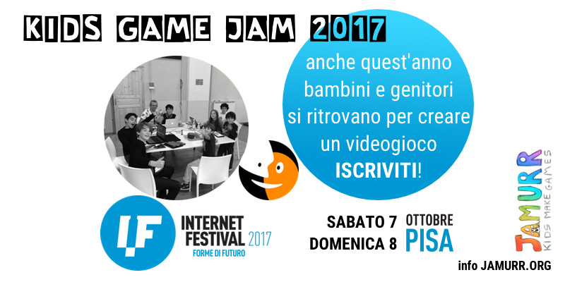

# Kids Game Jam @ Internet Festival 2017

# Regolamento e Iscrizione

> Oltre giocare, i bambini amano creare i loro giochi e inventare nuove storie.
> I videogiochi sono ottime occasioni per aiutarli a sviluppare nuove forme di collaborazione e di espressione, soprattutto emotiva.

<!-- @import "[TOC]" {cmd="toc" depthFrom=2 depthTo=6 orderedList=false} -->
<!-- code_chunk_output -->

* [Introduzione](#introduzione)
* [Dove e quando](#dove-e-quando)
* [Timeline della giornata](#timeline-della-giornata)
* [Tema](#tema)
* [Strumenti](#strumenti)
* [Sviluppo e Tecnologia](#sviluppo-e-tecnologia)
* [Attitudine](#attitudine)
* [Sicurezza](#sicurezza)
* [Pubblicazione del gioco finito](#pubblicazione-del-gioco-finito)
* [Iscrizione](#iscrizione)
* [Chi siamo](#chi-siamo)

<!-- /code_chunk_output -->

## Introduzione

Dopo la grande esperienza dell’anno scorso ([vedi](http://jamurr.org/project/7-frames/)), Internet Festival e JAMURR.org organizzano una seconda Kids Game Jam, una breve maratona di sviluppo videogame dedicata ai più piccoli. Adulti e bambini si troveranno per creare il prototipo di un videogioco in un fine settimana.

La cosa più importante? Lo faranno insieme, collaborando.

In breve:

- a Pisa, sabato 7 ottobre 2017, dalle 10:30 alle 18:30 e domenica 8, dalle 10:00 alle 17:00
- I bambini devono essere accompagnati da un genitore o tutore maggiorenne (fratello, zio, che collaborerà al progetto) ed avere un proprio computer/tablet
- All’inizio della Jam saranno formati i gruppi di lavoro (circa 6 bambini per gruppo).
- Il tema della Jam sarà rivelato ai partecipanti una settimana prima, così da poter iniziare a pensarci.
- Entro la domenica pomeriggio avremo il prototipo del gioco fatto e giocabile pronto per la pubblicazione online.
- L’iscrizione è gratuita e aperta a chiunque abbia almeno 7 anni: sarà data precedenza seguendo l’ordine temporale di iscrizione.

L’evento non è competitivo, anzi: l’interesse è la collaborazione tra bambini e tra bambini/tutor, stimolando soprattutto gli aspetti creativi e di progettazione dei giochi, più che quelli tecnici e realizzativi.

I bambini saranno soprattutto invitati e aiutati a pensare e progettare la storia, i personaggi, le ambientazioni, gli enigmi e a realizzare i disegni e scrivere le storie.

Sarà a cura dei tutor montare e programmare il prototipo, facendo vedere come si fa.

I partecipanti dovranno iscriversi compilando il modulo online (link alla fine di questo documento) e poi registrarsi onsite tra le 09:30 e le 10:30 di sabato 8 ottobre.

## Dove e quando

Sabato 7 e domenica 8 ottobre presso MixArt - via Bovio 11 - Pisa.

Si prega di iscriversi solo se si potrà garantire la presenza per tutta la durata dell'evento.

Ci si può presentare con uno o più bambini, oppure come semplici tutor.

Ogni bambino deve essere accompagnato da un genitore/tutor maggiorenne responsabile.

## Timeline della giornata

**sabato 7 ottobre**

- 9:30 registrazione
- 10:30 introduzione e formazione gruppi
- 11:00 inizio lavori (ideazione e scrittura della storia)
- 13:00 pausa pranzo e visita alla Jam dei “grandi”
- 14:00 produzione testi e grafica
- 18:30 chiusura giornata e revisione dei progetti

**domenica 8 ottobre**

- 10:30 revisione dell’idea di gioco
- 11:00 inizio montaggio assets grafici e testi
- 13:00 pausa pranzo
- 14:00 registrazione voci e audio
- 16:00 test finale
- 16:30 presentazioni lavori
- 17:00 saluti

## Tema

il tema del gioco da realizzare sarà comunicato almeno una settimana prima dell’evento, così che i bambini possano iniziare a pensarci. Sarà qualcosa collegato con situazioni reali della vita, la relazione con gli altri, le proprie aspirazioni (non vorremmo che realizzassero l’ennesimo sparatutto).

## Strumenti

L’organizzazione fornirà i materiali base quali:

- Una libreria di suoni (musiche e effetti) generici
- Tavoli e sedie
- Connessione internet WiFi
- Carta e matite
- acqua e piccola merenda e pranzi al sacco

## Sviluppo e Tecnologia

Data la natura non competitiva dell’evento e il tempo a disposizione, svilupperemo il gioco sul format del progetto dell’anno scorso, ovvero un’avventura visuale interattiva punta e clicca: giocala e analizzala: http://jamurr.org/project/7-frames/

La grafica sarà realizzata con Minecraft e pixel art, il montaggio con Unity e software open source, oppure tutto con Minecraft vedremo...

I ragazzi formeranno dei gruppi autonomi di 5/6 partecipanti, più relativi tutors. Ognuno penserà e creerà un suo personaggio del gioco, creandone caratteristiche, storia, grafica e discutendo con gli altri tutte le interazioni possibili.

Oltre ad aver cura del proprio "personaggio", ognuno apporterà al gioco le proprie specialità (scrittura, disegno, musica, programmazione)

## Attitudine

Ci interessa che i bambini (ma anche i grandi) si divertano e siano rilassati, per dare spazio e tempo alla creatività, al dialogo e all’imparare insieme.

Non è un evento competitivo. Non ci saranno premi per i più bravi.

Vorremmo che ognuno scopra qualcosa di nuovo di sé stesso e abbia l’occasione di esprimerla.

I videogiochi sono progetti multidisciplinari che ben si prestano a tutto questo.

## Sicurezza

E’ nostra massima attenzione il prevenire ogni tipo di problematiche nell’interazione con e tra i bambini. Ogni tutor partecipante sarà persona fidata/conosciuta. Ogni pubblicazione online sarà anonima o quanto meno senza alcun contatto diretto con i bambini.

Siamo noi stessi genitori attenti e i nostri figli parteciperanno a tutte le attività.

## Pubblicazione del gioco finito

Tutti i lavori saranno resi pubblici **open source** sotto licenza Creative Commons ([CC BY-SA 3.0 IT](https://creativecommons.org/licenses/by-sa/3.0/it/deed.it)) e pubblicati per essere giocati da amici e parenti su una piattaforma online pubblica e sicura.

## Iscrizione

Non rimane che compilare la form: https://docs.google.com/forms/d/e/1FAIpQLSc8ug5G9EkjoHMSOs4S-SPIwVnwnsw_gLm7A5Lb-N9iX2_l_A/viewform

Premettiamo che non garantiamo la partecipazione a tutti quelli che si iscrivono (i posti sono limitati e saranno assegnati mantenendo una giusta proporzione tra bambini e tutor).

Faremo del nostro meglio per accontentare quasi tutti e rendere la giornata piacevole a tutti i livelli.

## Chi siamo

Promotori e curatori dell’iniziativa sono Stefano Cecere, Michele Lanzo, Michele Gotuzzo, Mauro Vanetti
