---
presentation:
  width: 1024
  height: 1024
  controls: true
  slideNumber: true
---
<!--  
docs:
https://shd101wyy.github.io/markdown-preview-enhanced/#/presentation?id=presentation-front-matter
example: https://raw.githubusercontent.com/shd101wyy/markdown-preview-enhanced/master/docs/presentation-intro.md
-->

<!-- slide -->

IF Kids Game Jam 2017: il TEMA è

# Punti di Vista
> “Non è quel che si vede,
ma come si vede.”

&nbsp;
&nbsp;

<kbd>esc</kbd> per la panoramica

<kbd>frecce</kbd> per navigare

<kbd>?</kbd> per tutti i comandi

<!-- slide -->
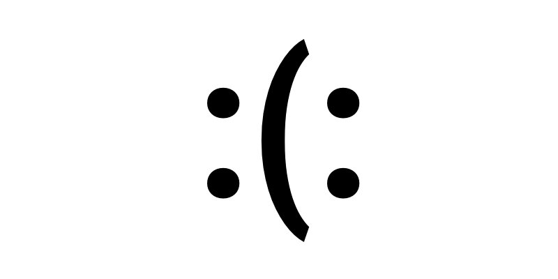
la vita è una questione di punti di vista

<!-- slide -->
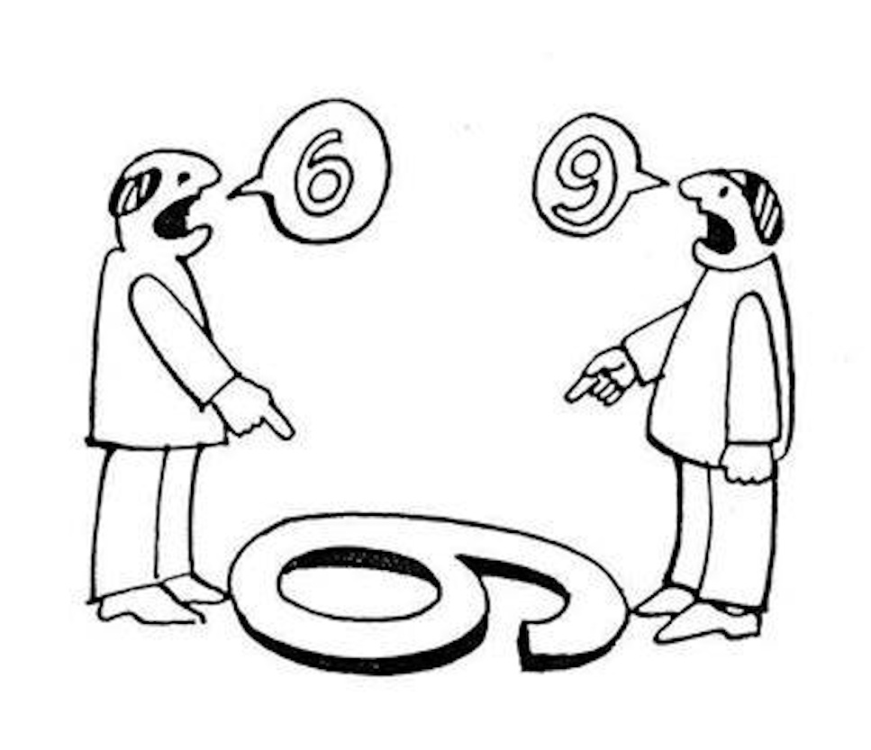
che tu abbia ragione non significa che io abbia torto

forse non guardiamo le cose dallo stesso punto di vista

<!-- slide -->
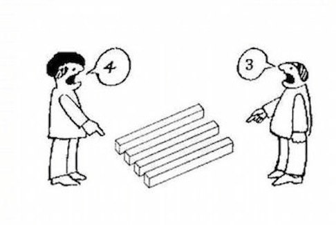

forse non ha ragione nessuno dei due.
<!-- slide -->
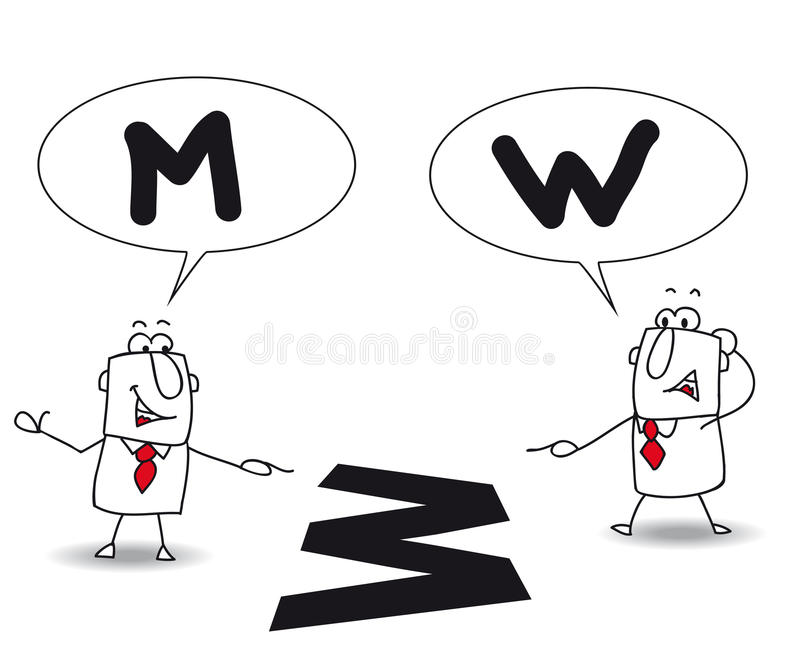
oppure hanno ragione entrambi!

<!-- slide -->
## il Punto di Vista
è
**da dove** e **come** guardiamo il mondo.
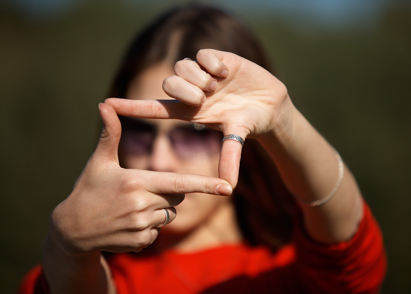

<!-- slide -->
## Punti di Vista
ce ne sono molti.. analizziamone alcuni
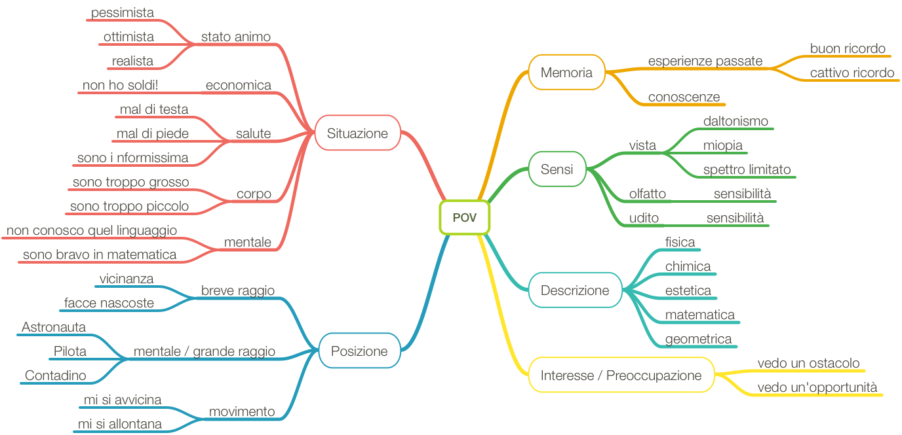

<!-- slide -->
## Sensi
i nostri sensi non sono tutti uguali!
<!--
- vista
  - daltonismo (io lo vedo rosso, tu no)
  - miopia (io non vedo questa cosa)
  - spettro limitato (non vediamo il calore o gli UV)
  - tetracromatismo (vedono più colori di noi)
- olfatto
  - sensibilità (alcuni esseri sentono odori a noi ignoti)
- udito
  - sensibilità (i gatti e i cani sentono MOLTI più suoni di noi)
-->

<!-- slide -->
## Posizione
Dove sta il nostro occhio o la nostra mente mentre osserviamo?

<!-- slide -->
<!-- Cilindro Cubo -->
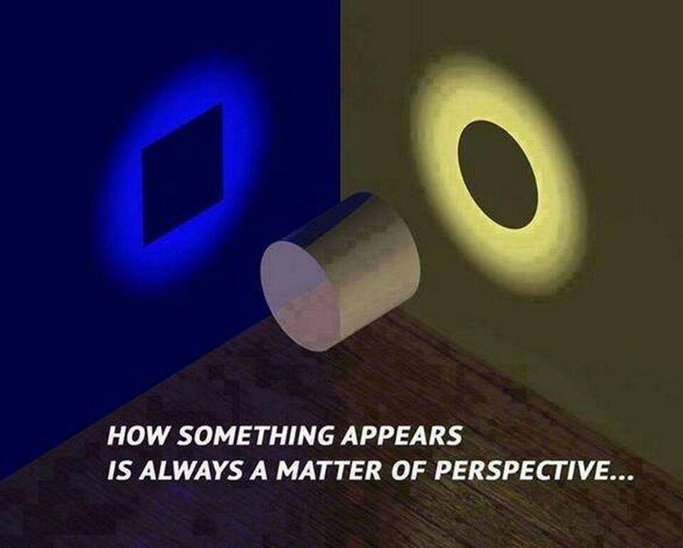
_dove sei vedi cose diverse_

<!-- slide -->
<!-- GEB -->

<!-- slide -->
<!-- GEB 2 -->
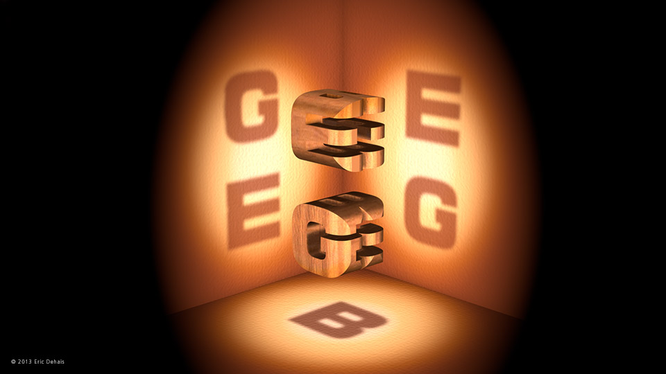

<!-- slide -->
## Posizione mentale
punto di vista dell'**Astronauta**
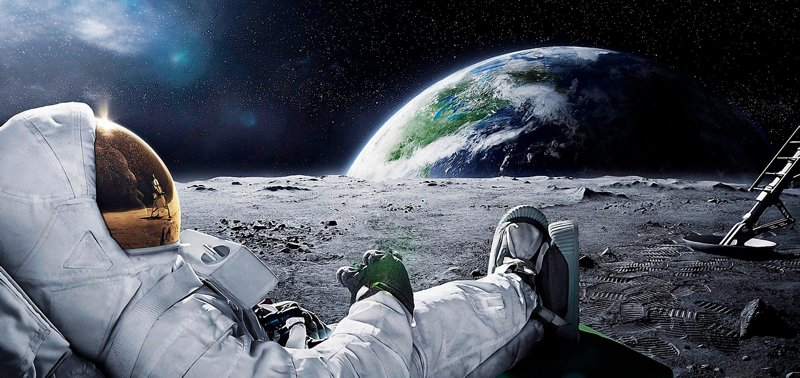
vede il mondo nella sua totalità

<!-- slide -->
## Posizione mentale
punto di vista del **Pilota**
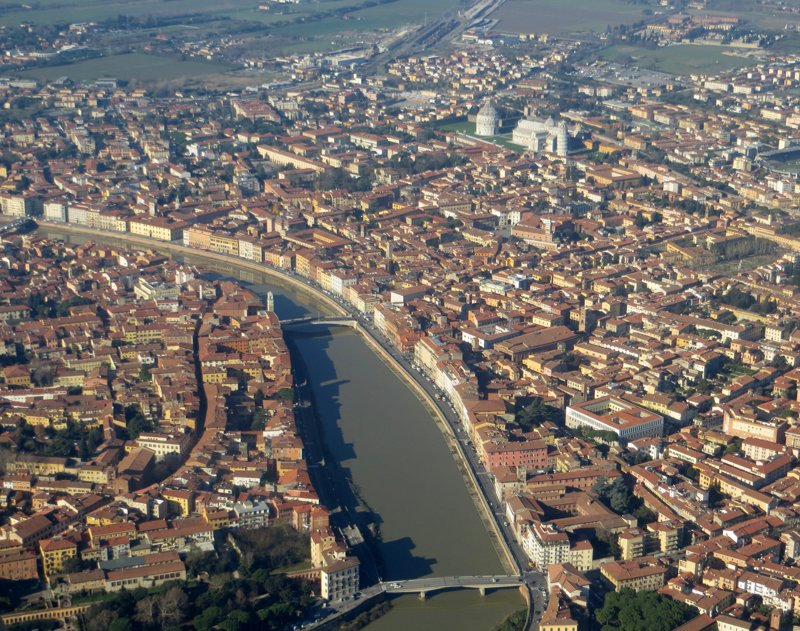
vede tutto il territorio

<!-- slide -->
## Posizione mentale
punto di vista del **Contadino**
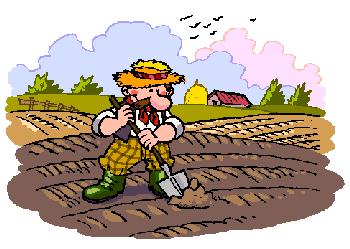
vede solo ciò che ha intorno

<!-- slide -->
## Situazione
Come sto? Chi sono? Come sono? Cosa mi piace?
tutto ciò influisce su come vediamo le cose.

<!-- slide -->
## Situazione
### stato animo
<!-- Tunnel -->
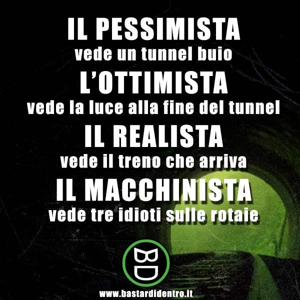

<!-- slide -->
## Situazione
  - non ho soldi!
  - ho una malattia incurabile
  - ho un forte nal di testa
  - sono maschio o femmina?
  - sono grassone
  - sono piccino
  - sono vecchietta

<!-- slide -->
<!-- Formica -->
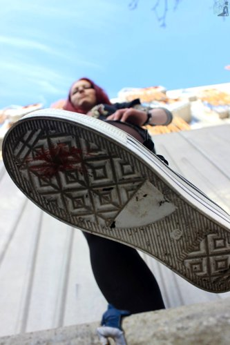
_una formica ci vede molto diversamente_

<!-- slide -->
## Situazione
    - sono disabile
    - non sono umano
    - mi sento a disagio quando c'è tanta gente
    - mi piace il silenzio
    - mi piace il caldo
    - mi piace l'ordine

<!-- slide -->
## Situazione
### ruoli
  - un insegnante ha un ruolo diverso dall'alunno
  - un genitore ha un ruolo diverso dal figlio
  - un ingegnere ha un ruolo diverso da un architetto

<!-- slide -->
<!-- Re -->
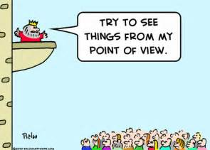

_Re e Popolo_
"Provate a vedere le cose dal mio punto di vista!"

<!-- slide -->
<!-- Alba -->
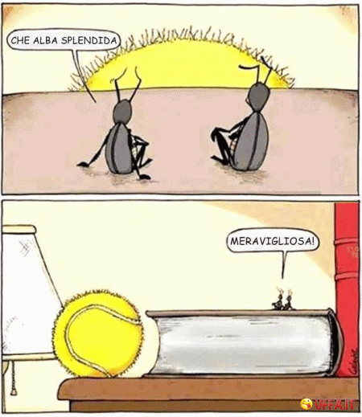
_qual che vediamo può non essere quel che sembra_

<!-- slide -->
<!-- Bimbo in aria -->
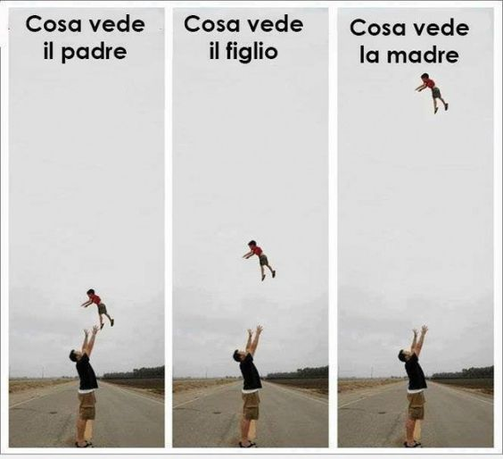
_da che parte stiamo e cosa ci immaginiamo_

<!-- slide -->
<!-- Bambini & colore pelle -->
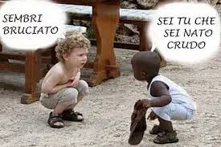

_non abbiamo scelto noi come e dove nascere_

<!-- slide -->
<!-- Coniglio papera -->
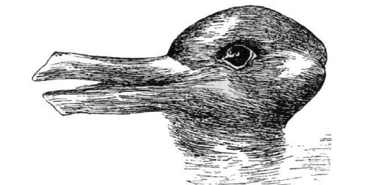
_e tu cosa vedi?_

<!-- slide -->
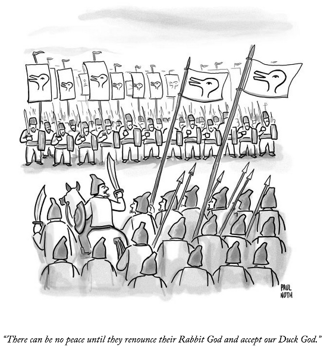
_Non ci sarà pace finchè non rinunceranno al loro Dio Coniglio e accetteranno il nostro Dio Papera_

<!-- slide -->
<!-- Elefante -->
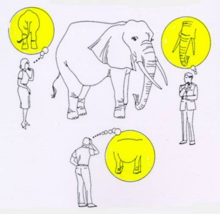
_io vedo ciò che ho davanti e ciò che mi interessa_

<!-- slide -->
<!-- Pecora Nera -->
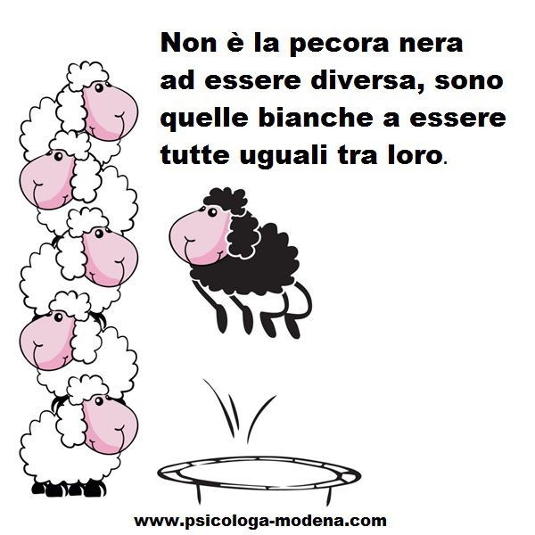
_Non è la pecora nera ad essere diversa,
sono quelle bianche a essere tutte uguali tra loro!_

<!-- slide -->
<!-- Relatività -->
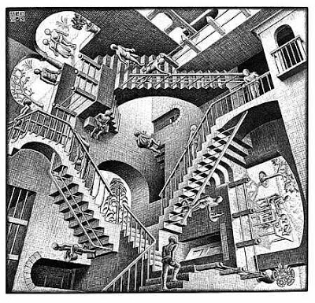

<!-- slide -->
<!-- Gatto -->
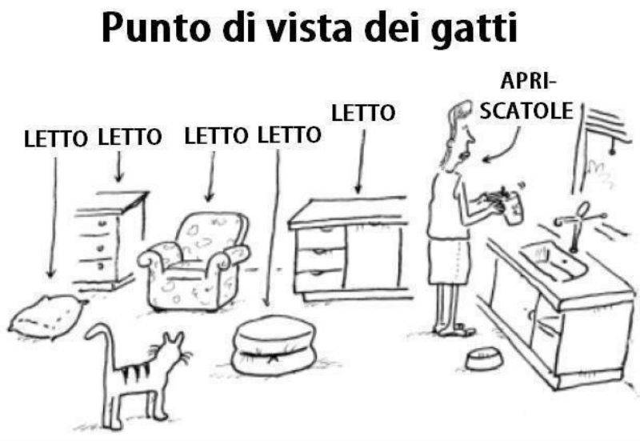
_ognuno vede ciò che vuole di più_

<!-- slide -->
<!-- Rinoceronte -->
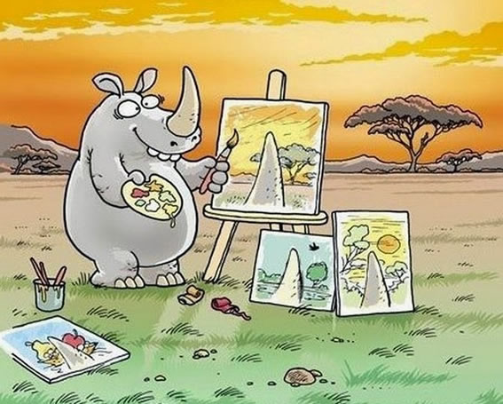
_alcune cose sono sempre lì che per noi sono "naturali"
ma non siamo tutti uguali!_

<!-- slide -->
<!-- Bicchiere -->
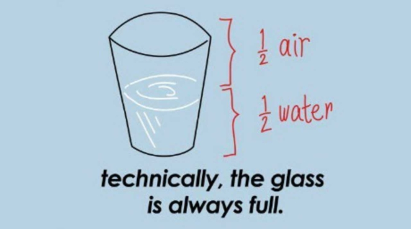
_tecnicamente il bicchiere è sempre pieno!_

<!-- slide -->
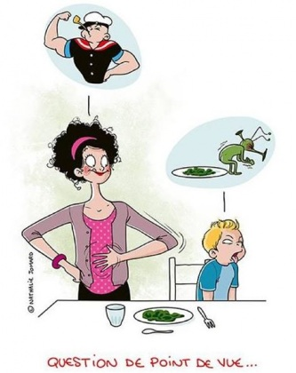

_Minestra (spinaci)_

<!-- slide -->
<!-- MonaLisa -->
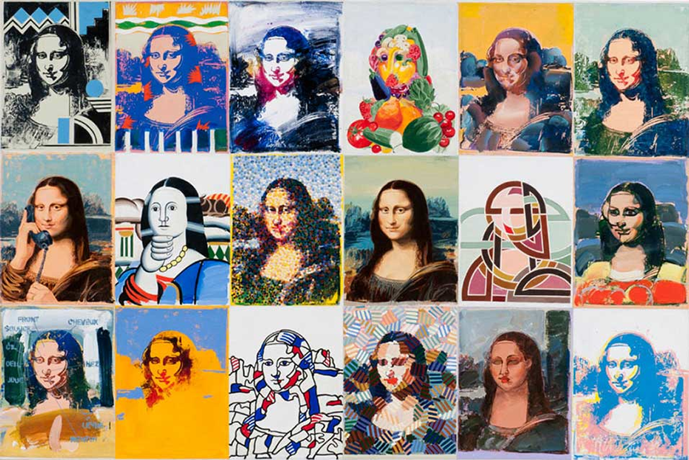
_MonaLisa come ti vedo..._

<!-- slide -->
<!-- Parallasse -->
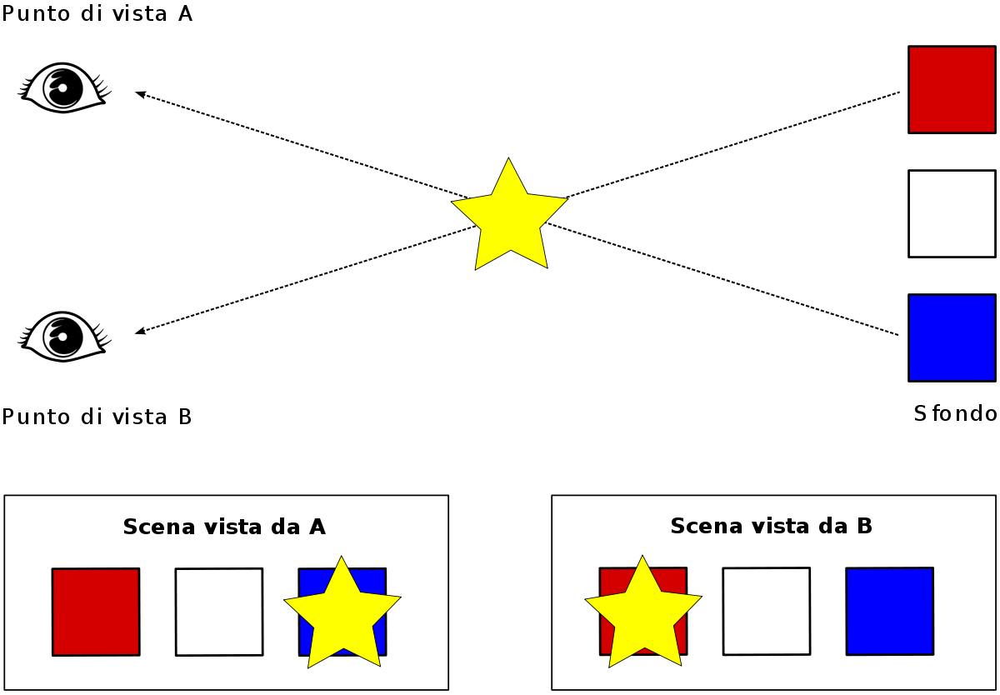

<!-- slide -->
<!-- Prospettiva 1 -->
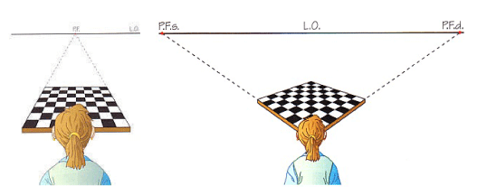
Dove guardiamo cambia la prospettiva

<!-- slide -->
<!-- Prospettiva 2 -->
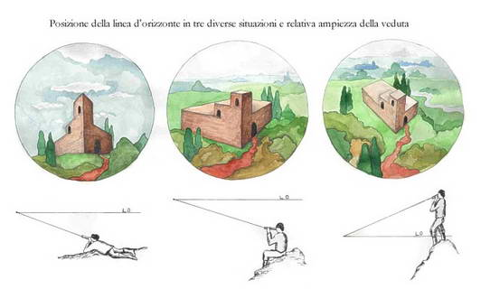
Prospettiva e linea dell'orizzonte

<!-- slide -->
Esperimento QuattrOcchi
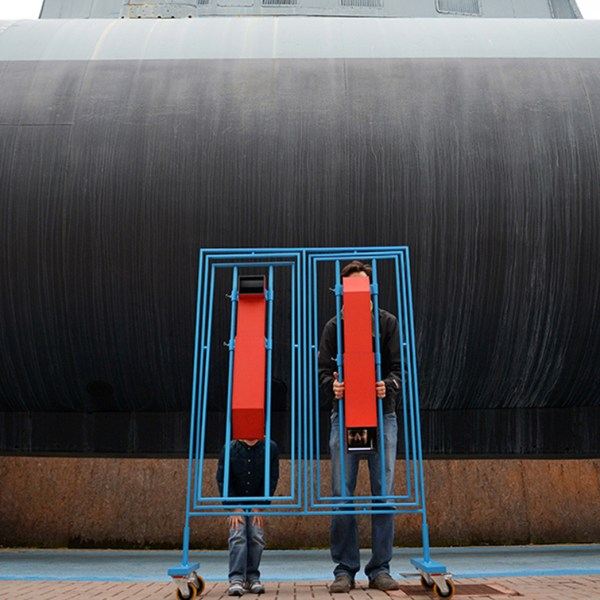
_una macchina per invertire i punti di vista bambino <> adulto_

<!-- slide -->
## film
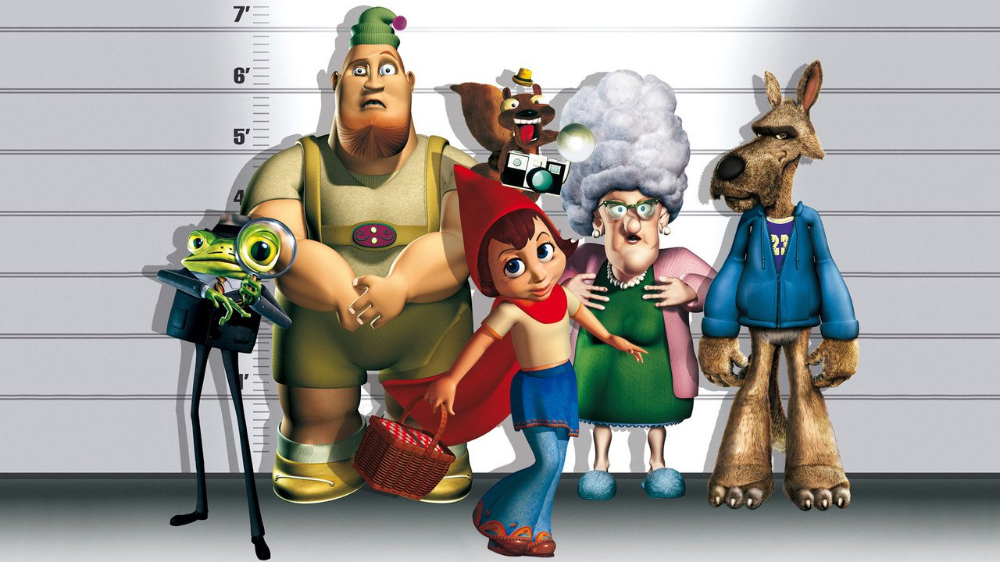
**Cappuccetto Rosso e i Soliti Sospetti**
la narrazione è un intreccio dei diversi punti di vista dei personaggi

<!-- slide -->
## film
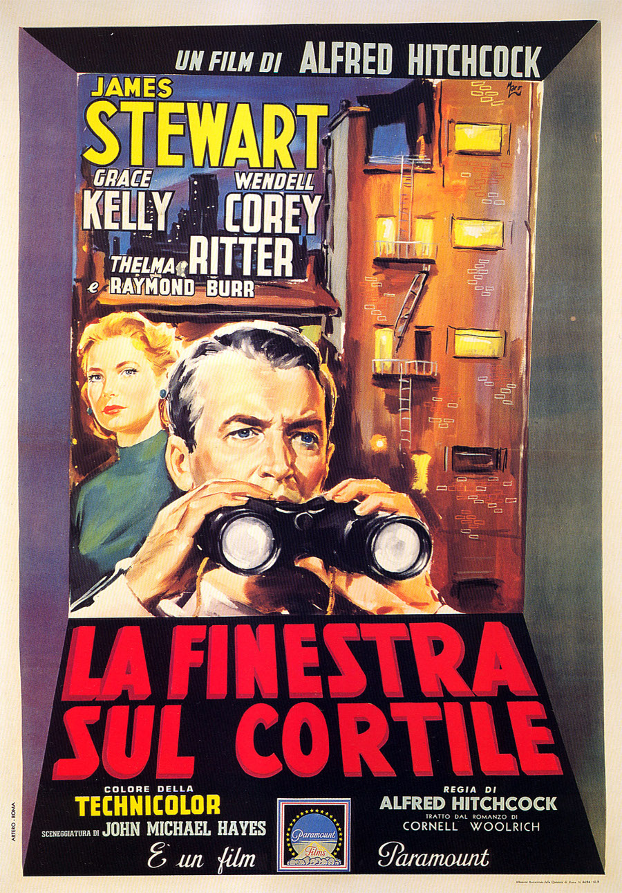
**La finestra sul cortile**
il protagonista è bloccato in casa e vede tutto con un binocolo

<!-- slide -->
## problema: visione a tunnel
ci si concentra solo sul proprio punto di vista e si è assolutamente incapaci di vedere le cose dal punto di vista altrui.
Ciò può portare a conflitti.

<!-- slide -->
## problema: l'illuso saputello
crediamo di aver ragione ma non ci rendiamo conto del nostro punto di vista, che è sempre parziale.
Ciò può portare a illudersi

<!-- slide -->
# trovare una soluzione
Ogni volta che entriamo in disaccordo con gli altri non chiediamoci: chi ha ragione? ma: come possiamo trovare una soluzione che possa soddisfare entrambi?

<!-- slide -->
# soluzioni:
Provare a mettersi nei panni dell'altro

<!-- slide -->
# soluzioni:
Provare a ricordarsi che il nostro è UNO dei punti di vista

<!-- slide -->
# soluzioni:
Cercare di capire da dove nasce il nostro punto di vista.

<!-- slide -->
# soluzioni:
Alcuni punti di vsita non li abbiamo scelti noi.

<!-- slide -->
# soluzioni:
Provare a cercare altri punti di vista

<!-- slide -->
# soluzioni:
Trovare un terzo punto di vista accettabile

<!-- slide -->
# Aforismi
“Non è quel che si vede, ma come si vede.”

---

_(scrolla giù per leggerne altri)_

<!-- slide vertical=true -->
“Noi non vediamo la realtà, ma la nostra interpretazione della realtà.”

<!-- slide vertical=true -->
“Dobbiamo sempre guardare le cose da angolazioni diverse. E il mondo appare diverso.”

<!-- slide vertical=true -->
“Visto dal fondo nessun mare è mai in tempesta.”

<!-- slide vertical=true -->
“Non gli era mai passato per la testa che si potesse affrontare quel problema da un altro punto di vista.”

<!-- slide vertical=true -->
“Per affrontare il destino bisogna osservare le cose da un'altra prospettiva.”

<!-- slide vertical=true -->
“Niente è bello sotto tutti i punti di vista.”

<!-- slide vertical=true -->
“È una questione di punti di vista: come gli aquiloni, che pensano che la terra sia attaccata al filo.”

<!-- slide vertical=true -->
“La vostra immagine del mondo è incompleta in un modo davvero straordinario e anomalo. Vedete solo quello che volete vedere."

<!-- slide vertical=true -->
“Sono davvero poche le situazioni irrisolvibili, a volte basterebbe cambiare punto di vista per accorgersi di poter intraprendere una via alternativa.”

<!-- slide vertical=true -->
“Guarda con i loro occhi: devi capire cosa vogliono.”

<!-- slide -->
# Buon lavoro!
da TUTTI i punti di vista ;)
---
[torna al sito della JAM](https://jamurr.github.io/JAM.IF2017/)
